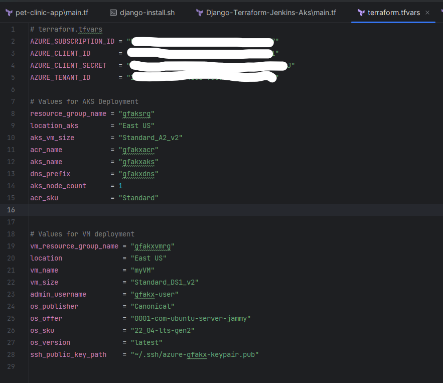
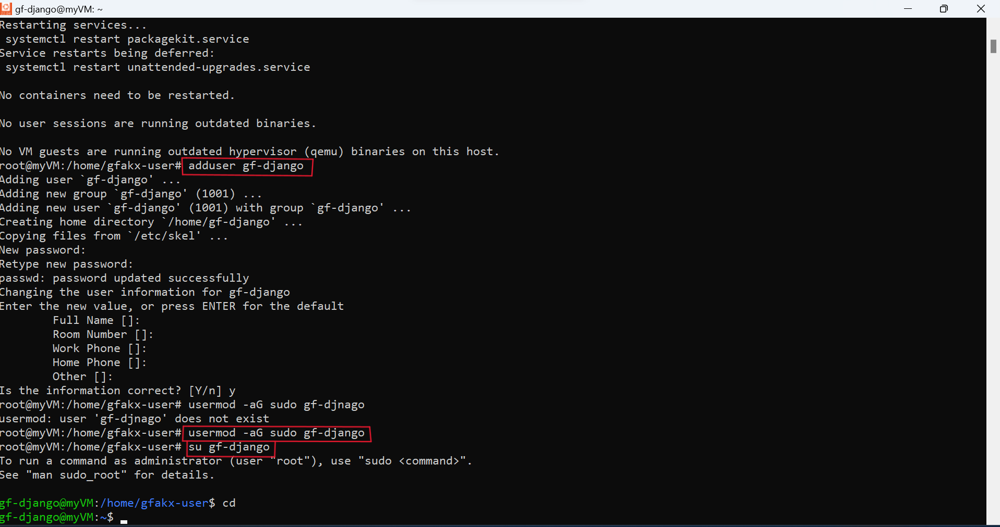
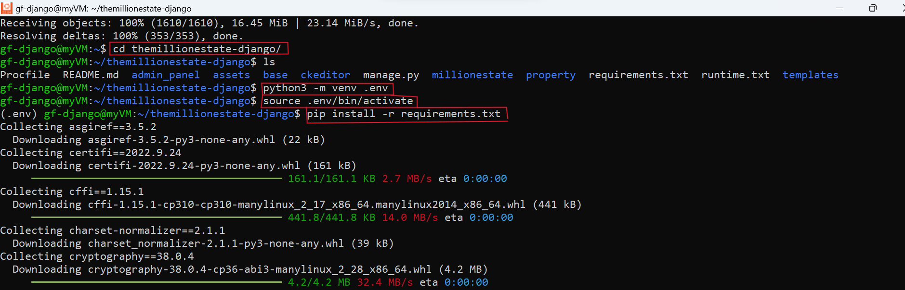
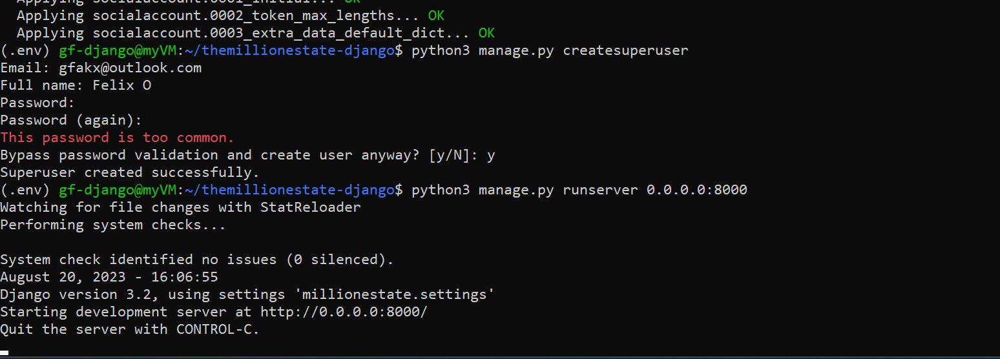
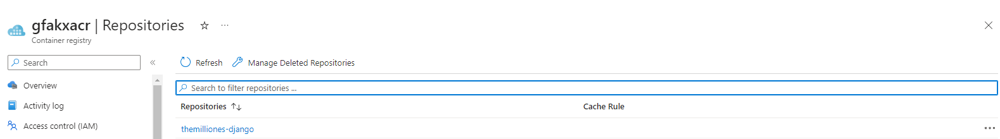
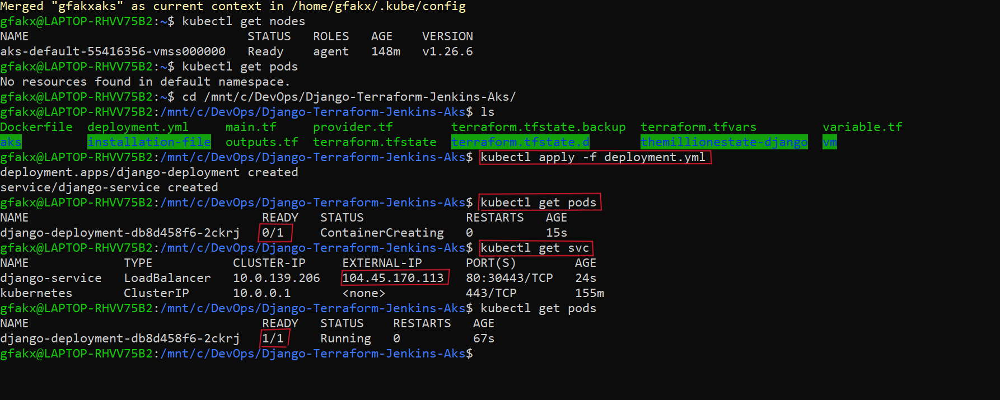
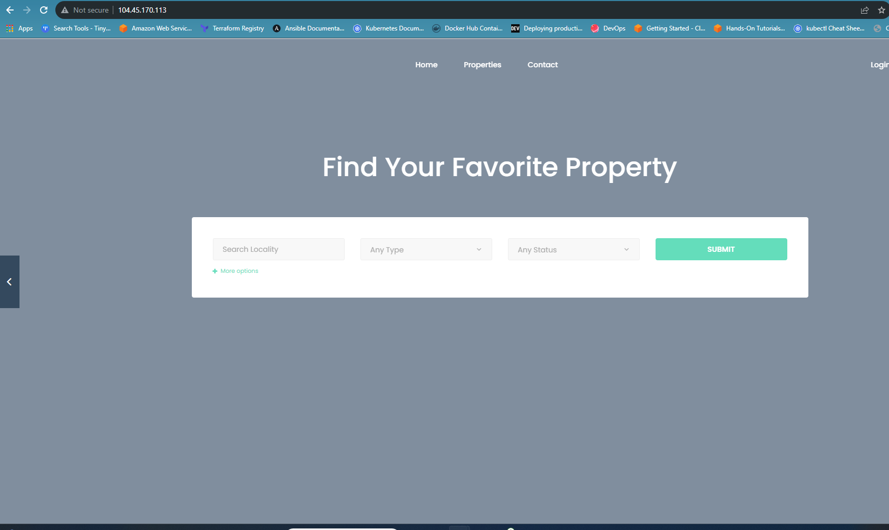

# Deploying a Django Application on Azure Kubernetes Service (AKS) using Terraform to setup the VM and AKS & ACR  infrastructure.

## Prerequisites:
- Azure Subscription.
- Terraform installed.
- Docker installed.
- Azure CLI installed.

## 1. Infrastructure Creation with Terraform:

### a. Azure Virtual Machine:
- Clone Source Repo :  git clone https://github.com/gfakx/IAC-Azure-Django.git
- cd into the root folder 
- Create a .tfvars and provide values and credentials to declared variables. (See image 1.a below for reference )
- Apply the Terraform configuration: `terraform init` , `terraform fmt`, `terraform validate`, `terraform plan`, `terraform apply`
   

### b. Azure Kubernetes Service (AKS) & Azure Container Registry (ACR):
- Same as 1.a

img 1.a

## 2. Azure Virtual Machine Configuration:

### a. SSH into the VM:
From  the Azure portal , follow on screen instruction to ssh into the vm.

### b. Update and Upgrade the VM:
Update the package list and upgrade the packages.   
'sudo apt-get update' && 'sudo apt-get upgrade'

### c. Use Provided Script to Install Necessary Tools:
Copy the `django-install.sh` script to the VM, ensure it's executable and run it.  
`chmod +x django-install.sh`  
`sh django.sh`

### d. Create a User and Assign Sudo Privileges:
Create a new user and assign sudo privileges.  
`sudo adduser django-user`  
`sudo usermod -aG sudo django-user`  
`su django-user`

img 2.a

## 3. Django Application Setup:

### a. CD to App Folder  :
'cd themillionestate-django' 

### b. Set Up Python Environment:
Move to the base directory, create a virtual environment, activate it, and install required packages.  
`python3 -m venv .env`  
`source .env/bin/activate`  
`pip install -r requirements.txt`  

img 3.a

### c. Configure Django:
Make migrations, apply them, and create a super user for admin access.  
`python3 manage.py makemigrations`  
`python3 manage.py migrate`  
`python3 manage.py createsuperuser`  

### d. Run the Django Application:
Start the server.  
`python3 manage.py runserver 0.0.0.0:8000`

img 3.b

## 4. Dockerization:

### a. Write Dockerfile:
Create a `Dockerfile` in the root directory of themillionestate-django directory.

### b. Build Docker Image:
Build the Docker image.  
`docker build -t name-django:latest`

### c. Run Docker Container:
Run the container locally.  
`docker run -d -p 8000:8000 name-django:latest`

## 5. Push to Azure Container Registry:

### a. Login to Azure and ACR:
Login to Azure and the ACR. ( Follow on-screen instruction on your Azure ACR page )  
`az login`  
`az acr login --name acr_name`  

### b. Tag Docker Image for ACR:
Tag the Docker image.  
`docker tag name-django:latest`    
`acr_name.azurecr.io/name-django:latest`

### c. Push Docker Image to ACR:
Push the Docker image.  
`docker push acr_name.azurecr.io/name-django:latest`

img 5.a

## 6. Deploy to Azure Kubernetes Service:

### a. Get AKS Credentials:
Get AKS credentials.  
`az aks get-credentials --resource-group rg_name --name aks_name`

### b. Deploy to AKS:
Use the appropriate Kubernetes manifests to deploy and access the application.  
`kubectl apply -f deployment.yml`  
`kubectl get nodes`  
`kubectl get pods`  
`kubectl get svc`  

img 6.a

img 6.b

## Troubleshooting:

- If faced with a 'tkinter' related dependency error during Django setup, resolve it by installing   
    `python3-tk: sudo apt install python3-tk -y`

- Ensure the VM's security group has port 8000 open when trying to access the application externally.  

- For Docker, ensure the Django application's settings.py is set with DEBUG = True and ALLOWED_HOSTS = ['*'] for testing.

